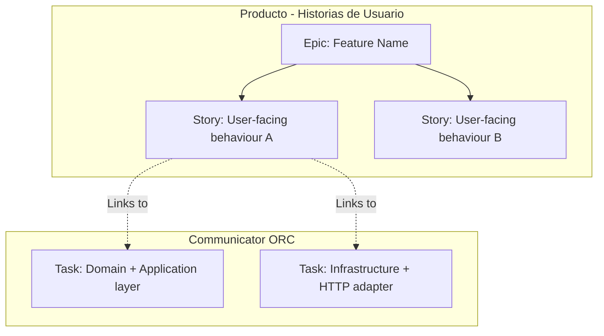

## Activation Contract

Use this skill whenever you are preparing a new feature, planning tickets in Jira, setting up branching patterns for a sprint, compiling documentation for Confluence, completing an SDD `tasks` phase, or archiving a merged feature into the Confluence Living Blueprint.

## Project Keys — scaffolding

Keys are defined in `openspec/config.yaml`. Read that file before creating any Jira issue. Current values:

| Key    | Project                         | Issue types |
| ------ | ------------------------------- | ----------- |
| `PHDU` | Producto - Historias de Usuario | Epic, Story |
| `CO`   | scaffolding                     | Task        |

If the keys change, update `openspec/config.yaml` — the skill reads from there, not from this file.

## Hard Rules (NEVER Break)

- **Living Blueprint Reconciliation**: Never leave feature PRDs/SDDs as disconnected documents. Once a feature is merged, its specifications MUST be reconciled into the Confluence Global Blueprint.
- **Jira Hierarchy Isolation**: User Stories live in `PHDU` (Producto - Historias de Usuario). Technical Implementation Tasks live in `CO` (Communicator ORC).
- **Assignee**: Every Epic, Story, and Task must be assigned to the user currently authenticated in the Atlassian MCP. Before creating any issue, call `atlassian_rovo_atlassianUserInfo` to get the current `account_id`. Never hardcode user data.
- **Labeling**: Every related Epic, Story, and Task must carry a matching unique feature label derived from the SDD change name (e.g., `entity-create-v1`).
- **Branch Naming**: Branching is mapped strictly to **Technical Tasks (Jira Tasks)**, NOT User Stories. Branches must use the format `feature/CO-<TaskNumber>-<short-description>`.

---

## 1. Documentation Strategy (Confluence & Growth)

### 📘 The "Living Blueprint + Feature RFC" Pattern

To prevent documentation rot and maintain a high-quality, readable knowledge base:

1. **Global Living Blueprint (Confluence)**:
   - Represents the **current state** of the entire application.
   - Contains: architecture overview, active API catalog, core data models, and global business rules.
   - Single source of truth for onboarding and daily reference.

2. **Feature PRD / SDD (Git & Local RFCs)**:
   - Created for a **specific change or delta** (e.g., `feat-entity-create-v1`).
   - Lives inside the codebase as markdown files (under `openspec/`) during development, versioned alongside code.

3. **Reconciliation Flow (Upon Merging)**:
   - Once a feature is merged and deployed:
     - The architect **refactors the changes** back into the **Global Living Blueprint** on Confluence (updating schema models, REST endpoint list, and user flows).
     - The local feature PRD/SDD files are archived as historical changelog records.
     - Business and support teams read the **Global Living Blueprint** — never obsolete feature-specific specs.

---

## 2. Jira Hierarchy Setup

The hierarchy keeps Product Management separated from Engineering Execution:



### 📋 Setup Steps:

0. **Resolve current user**: Call `atlassian_rovo_atlassianUserInfo` and store the returned `account_id`. Use it as the assignee for every issue created in this session.

1. **Create Epic**:
   - **Project**: `PHDU`
   - **Summary**: `Epic: <Feature Name> (<sdd-change-label>)`
   - **Label**: `<sdd-change-label>` (e.g., `entity-create-v1`)

2. **Create Stories**:
   - **Project**: `PHDU`
   - **Issue Type**: `Story`
   - **Summary**: Maps directly to the SDD/PRD Stories (user-facing language).
   - **Description**: Include the Gherkin BDD Scenarios (GWT) as acceptance criteria — copy from the SDD `spec` phase artifact.
   - **Links**: Linked as child of the Epic.
   - **Label**: `<sdd-change-label>`

3. **Create Technical Tasks**:
   - **Project**: `CO`
   - **Issue Type**: `Task`
   - **Summary**: Concrete technical work unit — copy directly from the SDD `tasks` phase output.
   - **Description**: Reference the corresponding steps from the SDD Implementation Plan.
   - **Links**: Link each task to its parent User Story in `PHDU` using `relates to`.
   - **Label**: `<sdd-change-label>`

4. **Cross-Project Filter & Unified Board**:
   - **JQL Filter**:
     ```sql
     labels = <sdd-change-label> ORDER BY Rank ASC
     ```
   - Save the filter as `Board-<sdd-change-label>`.
   - Create a **Kanban board** from the saved filter for a unified view across Product and Backend.

---

## 3. Git Branching Strategy (Branch-to-Task Mapping)

### 🧱 The 1:1 Branch-to-Task Rule

Branches are strictly mapped to **execution-level Jira Tasks**, not User Stories or Epics:

1. **Naming Convention**:

   ```
   feature/<ProjectKey>-<TaskNumber>-<short-description-slug>
   ```

   Examples:
   - `feature/CO-12-entity-create-http-adapter`
   - `feature/CO-13-entity-create-mongo-repository`

2. **PR Flow**:
   - Every task branch creates a Pull Request targeting `main`.
   - Commit messages reference the Jira task key when useful:
     ```
     feat(core): CO-12 add EntityPostCreateController and HTTP adapter
     ```
   - Keep PRs under 400 lines to protect reviewer workload.

---

## 4. SDD Integration

This skill hooks into two SDD phases:

### After `sdd-tasks` phase

When the SDD `tasks` phase completes, use this skill to:

1. Map each generated SDD task to a **Jira Technical Task** in `CO` (scaffolding).
2. Group tasks under Stories in `PHDU`, deriving Story titles from the SDD spec acceptance criteria.
3. Create the Epic in `PHDU` using the SDD change name as label.
4. Output a ready-to-paste Jira hierarchy (Epic → Stories → Tasks) with labels, links, and JQL filter.

### After `sdd-archive` phase (upon merging)

When the feature is merged and the SDD `archive` phase runs:

1. Identify which sections of the Confluence Living Blueprint need updating (API catalog, data models, business rules).
2. Draft the Confluence update content from the SDD `spec` and `design` artifacts.
3. Mark the local `openspec/` SDD files as archived.

---

## Output Contract

When asked to set up or map a new feature, provide a clear mapping in this structure so the user can copy-paste directly into Jira:

```
## Jira Hierarchy — <feature-name>

**Label**: <sdd-change-label>
**Assignee**: <account_id from atlassian_rovo_atlassianUserInfo>
**JQL**: labels = <sdd-change-label> ORDER BY Rank ASC

### Epic [PHDU]
- Summary: Epic: <Feature Name> (<sdd-change-label>)

### Stories [PHDU]
1. <Story summary> → Gherkin: <scenario title>

### Technical Tasks [CO]
1. <Task summary> → Branch: feature/CO-<N>-<slug>
2. <Task summary> → Branch: feature/CO-<N>-<slug>
```
